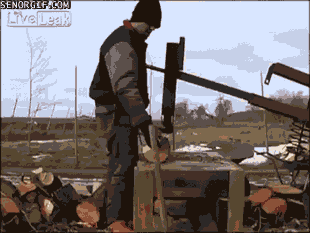
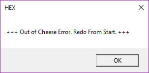

# A Tale of Web Crawler Optimization
## We Boldly Go (where many have gone before) 
We are on a mission to index all the internal pages of a site. To make this more interesting we have decided to apply as much over engineering as time allows. This means:
 
1) Crawling as quickly as we can 
2) Crawling the biggest websites we can

Now, I'm hardly a master at really deep performance optimization and I'm pretty new to Go, but we are going to have a shot at making our crawler as fast as possible anyway.

In this we are going to have to balance a few things:
* speed of processing discovered pages
* stability - especially for large sites
* code readability and maintainability

## In The Beginning
After standing up a basic scraper (for extracting links) and crawler (for queuing up and following pages) it was time to see if our concurrency model was operational. 

We can predict that I/O should be the biggest bottleneck on performance - if we only get page at time even a small site will take an age to crawl. So we need to bring up parallel requests to make better use of resources availble to us - yet still maintain control over concurrency.

First we run a range of worker counts to asses if our concurrency model is working. We aren't doing any averaging of results here so the numbers are not accurate - we are just looking to get a feel for how our concurrency is performing.

| Site  | Pages | 1 Worker | 10 Workers | 25 Workers  | 50 Workers | 100 Workers | 1000 Workers | 10000 Workers |
|---|---|---|---|---|---|---|---|---|
| https://www.magicleap.com | 109 | 2167ms  | 712ms | 830ms |  576ms | 469ms  | 525ms  | 761ms |
| https://www.akqa.com | 417 | 27348ms  | 2722ms | 2476ms  | 2603ms  | 2405ms   | 1674ms  | 2521ms |
| https://monzo.com | 1351 | 747346ms  | 90327ms | 36993ms |  21567ms | 17062ms  | 16335ms  | 18041ms |


The results are encouraging - we definitely have parallel operations taking place and we are getting some benefits from them! 

Lets not get too excited though, at this stage we are keeping all the pages in memory before moving on to write out the results and these websites are pretty tiny.

Entertainingly our performance seems to be limited more by the number of urls we have discovered then anything else. For example when we hit empty pages like [this](http://monzo.com/blog/authors/kate-hollowood/11) we seem to only discover one link each time (the next link) - which means that we only end up using a couple of workers in parallel.

To get some real performance insights we need to really stress the solution. When we crawl a big complex site like [The BBC](https://www.bbc.co.uk) for a short time we get some interesting results:

* CPU sits around 30% utilization
* Memory eventually gets exceeded and the system starts paging
* Bandwidth sits constantly at 75Mbps - 80Mbps

Now this is more like the data that we need! 

## Observations
So some observations:

* Bandwidth is our key limiting factor when we encounter a big site that responds quickly - excellent news!
* For small sites - we hit a point where the number of parallel workers doesn't matter so much, or worse degrades performance due to resource allocation times 
* We are blowing up memory
    * This is largely because we are storing everything in memory and not streaming out our results
    * Paging oddly doesn't seem to hurt us that much (CPU doesn't go through the roof) - but then we are using a physically attached SSD
    * This will cause problems on a VM where memory is more expensive and page file may not be available
    * The use of caches and streaming results to storage (rather then hanging on to them) should clear up a lot of this
    * We could probably be more efficient with memory we are using by keeping only what we need and being mindful of the operations we are doing

This leaves us with a couple of things to think about

* Do less work
  * Are we fetching too many urls? Our ruleset is pretty greedy - is it a href? is it on the same domain? EAT IT!
* Stream our results somewhere
  * We are hanging onto all of our results for a big bang tada moment at the end
  * Easy to implement but with really big sites (or if we followed external links) we would eventually exhaust every resource available to us
  * Dumping the results somewhere would probably free up memory really quickly        
* Optimize our memory usage
* Preload urls
  * If we could get a head start on the pages of a site we could improve how much concurrent work we have on small sites
  * It's almost like this is what sitemaps were invented for...
  * Given the brief this is probably cheating (why not just return the sitemap and goto the pub?)
  * Whilst we are there we could also grab robot.txt to discount urls we should avoid
    
My my, that's quite a list. Let's try and get through as much as we can shall we?

## Do less work
The best way to be more efficient is to be **lazier**. Well the right kind of lazy anyway - more "the art of maximizing the amount of work not done" rather then heading off to the pub at 16:30.



Lets take a look at a few we of the things we can do in this area.

### Only treat pages on the same protocol as internal
We are currently treating both http and https for the host as being internal links, [sitemaps.org](https://www.sitemaps.org/protocol.html) tells us this is not right.

We can see a ton of what looks like duplicated pages for several of the sites under test so we can safely assume we should see an improvement if we do this.  

What happens when we did this?
 
| Site  | Pages | 1000 Workers Run 1 | 1000 Workers Run 2 | 1000 Workers Run 3 | 1000 Workers Avg | Page Count | Performance Change | 
|---|---|---|---|---|---|---------|---------|
| https://www.magicleap.com | 109 | 526ms | 635ms | 509ms | 556ms | 0 (0%) | +31ms (+0.06%) |   
| https://www.akqa.com | 177 | 928ms | 1078ms | 938ms | 981ms | -294 (-70%) | -693ms (-41%) |
| https://monzo.com | 688 | 14334ms  | 14341ms | 12684ms | 13786ms | -663 (-49)%  | -2549ms (-16%) | 
 
How exciting! Interestingly two of the sites had a large number of mixed links, not so surprisingly crawling less pages dramatically reduced time.

We will be loosing some pages if the site is badly linked together sadly - this is a part of good SEO practice so it's reasonable for us to not attempt to work around this. Really no-one should be linking to http, and we could use the results from the crawler to discover and quickly fix the naughty pages.

### Avoid chasing files
We are currently following urls which are not html pages at all (eg pdf's, png's and other common file types). These links will probably never give us a `text/html` response so why are we trying? 

We can see some Content-Type mismatch errors being printed to screen whenever we encounter one of these non-html entities and we are incorrectly treating them as broken pages. This is probably a bug so lets just fix it and see what happens.

After making this change it was clear that only [Monzo](https://www.monzo.com]) had any noticeable change from the number of pages crawled with -13, [AKQA](https://www.akqa.com) had 0 and [Magic Leap](https://www.magicleap.com) had 1. Crawl times in all cases appear to have not really noticed the impact sadly.


In order to understand the benefits of this we should take a look at a site which has a large number of download links. [Citizens Advice Scotland](https://www.cas.org.uk) have many reports offered up as pdf - so it would seem like an excellent choice. 
 
So first a benchmark without the file filter:
 
| Site  | Pages | 1000 Workers Run 1 | 1000 Workers Run 2 | 1000 Workers Run 3 | 1000 Workers Avg |  
|---|---|---|---|---|---|
| https://www.cas.org.uk | 1,329 | 40,512ms | 42,160ms | 37,021ms | 39,897ms |

And when we apply the filter:

| Site  | Pages | 1000 Workers Run 1 | 1000 Workers Run 2 | 1000 Workers Run 3 | 1000 Workers Avg |  
|---|---|---|---|---|---|
| https://www.cas.org.uk | 520 | 1398ms | 1413ms | 1389ms | 1430ms |

Wow! The difference for download heavy sites is staggering 61% less "pages" to crawl resulting in a 96% less crawl time.


What's the fun of working in Go if you can't break out an animated gopher when things go well?

**UPDATE:**
It was later discovered that: 
1) [Citizens Advice Scotland](https://www.cas.org.uk) is very slow with a very fast cold cache
2) Were omitting query params from page url normalization - query params are allowed in sitemaps according to sitemaps.org  
3) Using a worker count of 1000 isn't very polite or even the most efficient number of workers  
4) There is still a self evident benefit in this

I'm not one to put a dancing gopher back in the box, so I returned to this after the optimizations below (and output writing) had been implemented.

So first a benchmark without the file filter:

| Site  | Pages | 250 Workers Run 1 | 250 Workers Run 2 | 250 Workers Run 3 | 250 Workers Avg | 
|---|---|---|---|---|---|
| https://www.cas.org.uk | 3,996 | 78,109ms | 75,963ms | 80,415ms | 78,162ms |

And one with:

| Site  | Pages | 250 Workers Run 1 | 250 Workers Run 2 | 250 Workers Run 3 | 250 Workers Avg |  
|---|---|---|---|---|---|
| https://www.cas.org.uk | 2,543 | 5,402ms | 5,971ms | 6,335ms | 5,902ms |

We didn't quite see the same performance benefit (93% vs 96%) but we are splitting hairs here - this optimization has a huge benefit for some sites. Double gopher.
 
 


## Crawling Really Big Sites 
We've managed to achieve some pretty good crawl times by this point!  For small sites we are still not even scratching the surface of our machines resources - the websites performance and our network link are still the biggest bottlenecks.

It isn't enough to just go fast however, we need to go fast and remain stable - we have to give ourseleves the best chance to make it to the end of a site, otherwise we have failed in our mission.

We can easily predict that eventually memory will explode if we just hang onto all of the data forever, so first a quick file writer was implemented to stream page results to a file. This slows us down a bit and improving the performance of the writer is now on the list of optimizations to make.

Once we dealt with the obvious, it's time to test our stability against one of the oldest and largest websites on the internet: [The BBC](https://www.bbc.co.uk). 

Go go:
```
go run cmd/crawl.go -url=https://www.bbc.co.uk -workers=500
```


With 500 workers, on the first run of this website we hit an out of virtual memory exception - meaning that we managed to consume all of the available memory and page file! Whoops.



A part of this is inevitable. We are trying to write out pages we are done with as quickly as possible to disk so that the garbage collector can tidy up for us, however we have two in memory caches tracking our progress. Our in progress cache can explode if we can't get through the queue fast enough and our completed cache will grow indefinitely - eventually eating every bit of memory available. 

This leaves us a few options to move forwards:

1) Distribute the work over multiple machines 
2) Switch to disk backed caches
3) Store smaller objects in the cache
4) Hunt for other optimizations

Distributing the work over multiple machines just sounds like throwing money at the problem. Brute forcing our way out of the issue is definitely an option, but do we really want complicate the solution and spin up all that infrastructure just yet? 

Switching to a disk backed cache seems inevitable if we want to crawl the whole web, but all that extra IOPs is going to really slow us down. One day we will need it, but is that day today?

We can probably do a refactor to minimize our memory usage - though this might well come at the expense of the API for our packages and readability.

Finally we have to consider if there is anything else hurting us that we are unaware of? Ideally we should be informing our optimizations with some kind of data to know if we are moving in the right direction...

Lets take a little look at the results from our crawl. Our last log message tells us the current state of the process:

```
Discovered Pages: 2,714,777
Pages Processing: 1,844,070
Crawl Queue: 1,843,066
Crawled: 870,707

Start: 2019/02/04 09:02:12
End: 2019/02/04 11:42:28
```

All in all, not bad. We got through 870k of pages in 2hr 40 mins and had 1.8M pages waiting in the wings to be crawled. At 80 pages per second we are well below what we witness at the start of the crawl.

As a side note we wrote out some pretty huge files, about 5GB of page data and 20GB of link data.

Considering that our machine has a whopping 16GB of 2666mhz DDR4 ram and a huge page file to boot however, these numbers actually seem somewhat low to me.


Having read some about pprof it's probably time to give it a go and see if we can draw any insights.

So first up we will wrap our crawl command in a test and execute it with some benchmarking:

```
go test -cpuprofile cpu.prof -memprofile mem.prof -bench .
```

Targeting [Monzo](https://www.monzo.com) we can get the following pretty svg out of pprof and [graphviz](docs/pprof002.svg).

There was only one thing going through my mind when I saw this: 


The majority of memory being allocated was no where near where I thought it would be - instead it looks like our isFile check is exploding due to a regex creation in the standard library.

This function looks a little bit like:

```
func isFile(testUrl url.URL) bool {
	extensionRegex := regexp.MustCompile("\\.[\\w]+$")
	extension := extensionRegex.FindString(testUrl.Path)
	...
}
``` 

We'd previously optimized this due to regex performance on a big old group search, but it still had problems! Creating the matcher as a constant var at the package level gives us the following [graphviz](docs/pprof003.svg).

With a single line change, we've achieved 1GB reduction in memory usage for this very small website - nearly an 80% reduction in memory allocation. 

Certainly it hadn't occurred to me this might pose a problem. Today I learned something, thank you pprof.

And now we have some targets for our refactors:

```
Showing top 10 nodes out of 129
      flat  flat%   sum%        cum   cum%
   33.52MB 12.80% 12.80%    34.52MB 13.18%  github.com/jjmschofield/gocrawl/vendor/golang.org/x/net/html.(*Tokenizer).Token
   22.12MB  8.45% 21.24%    22.12MB  8.45%  github.com/jjmschofield/gocrawl/internal/app/links.ToLinkGroup
   19.70MB  7.52% 28.76%    30.78MB 11.75%  github.com/jjmschofield/gocrawl/internal/app/crawl.createPages
   18.05MB  6.89% 35.66%    18.05MB  6.89%  compress/flate.(*dictDecoder).init
   17.71MB  6.76% 42.42%    45.71MB 17.45%  github.com/jjmschofield/gocrawl/internal/app/links.FromHrefs
      10MB  3.82% 46.23%       10MB  3.82%  strings.(*Builder).WriteString (inline)
    9.03MB  3.45% 49.68%     9.03MB  3.45%  bytes.makeSlice
    8.51MB  3.25% 52.93%    11.02MB  4.21%  encoding/json.Marshal
    7.58MB  2.89% 55.82%     7.58MB  2.89%  github.com/jjmschofield/gocrawl/internal/app/pages.ToPageGroup (inline)
    7.52MB  2.87% 58.69%     7.52MB  2.87%  bytes.(*Buffer).String
``` 

Tokenizer is out of our control for now so we'll leave that alone for now - though maybe that scrape process could be made a bit more efficient?

Our links.ToLinkGroup seems like it is using more memory then it should, not surprising as it's doing lots of slice append operations. So lets start there:

After replacing our LinkGroup construct with a simple map of links we drop about 20mb of memory allocation and get this [graphviz](docs/pprof004.svg).

Our top now looks like:

```
 Showing top 10 nodes out of 119
       flat  flat%   sum%        cum   cum%
    36.05MB 15.75% 15.75%    36.55MB 15.97%  github.com/jjmschofield/gocrawl/vendor/golang.org/x/net/html.(*Tokenizer).Token
    19.60MB  8.56% 24.31%    19.60MB  8.56%  compress/flate.(*dictDecoder).init (inline)
    19.27MB  8.42% 32.74%    19.27MB  8.42%  bytes.makeSlice
       15MB  6.55% 39.29%       15MB  6.55%  strings.(*Builder).WriteString (inline)
    13.56MB  5.92% 45.21%    40.68MB 17.78%  encoding/json.Marshal
    10.03MB  4.38% 49.60%    10.03MB  4.38%  bytes.(*Buffer).String
     9.50MB  4.15% 53.75%     9.50MB  4.15%  reflect.Value.MapIndex
     9.01MB  3.93% 57.68%     9.01MB  3.93%  net/http.(*http2clientConnReadLoop).handleResponse
     8.50MB  3.72% 61.40%    24.50MB 10.71%  github.com/jjmschofield/gocrawl/internal/app/writers.WriteLinks
     6.07MB  2.65% 64.05%    35.20MB 15.38%  github.com/jjmschofield/gocrawl/vendor/golang.org/x/net/html.(*Tokenizer).readByte
```

Next we reduce the amount of data we copy over channels by sending smaller objects and simplify our page and link structs to store url strings rather then full URL objects. This also has the benefit of simplifying our json marshal operation and in total we shave another ~10% and giving us a top like:

```
Showing nodes accounting for 133.78MB, 66.68% of 200.62MB total
Dropped 67 nodes (cum <= 1MB)
Showing top 10 nodes out of 122
      flat  flat%   sum%        cum   cum%
   34.53MB 17.21% 17.21%    34.53MB 17.21%  github.com/jjmschofield/gocrawl/vendor/golang.org/x/net/html.(*Tokenizer).Token
   24.76MB 12.34% 29.55%    24.76MB 12.34%  compress/flate.(*dictDecoder).init (inline)
   16.25MB  8.10% 37.65%    16.25MB  8.10%  bytes.makeSlice
   12.60MB  6.28% 43.93%    12.60MB  6.28%  net/http.glob..func4
   11.50MB  5.73% 49.66%    11.50MB  5.73%  strings.(*Builder).WriteString (inline)
    7.52MB  3.75% 53.41%     7.52MB  3.75%  bytes.(*Buffer).String
    7.03MB  3.50% 56.92%    31.79MB 15.84%  compress/flate.NewReader
    6.57MB  3.28% 60.19%    21.18MB 10.56%  encoding/json.Marshal
    6.52MB  3.25% 63.44%    33.02MB 16.46%  github.com/jjmschofield/gocrawl/internal/app/links.FromHrefs
    6.50MB  3.24% 66.68%     6.50MB  3.24%  net/http.(*http2Framer).readMetaFrame.func1
``` 

And a graph that looks a like this [graphviz](docs/pprof005.svg).

We'll also ditch writing out links separately as it seems like we are optimizing writes for a query we don't need yet - eg get me all telephone numbers on a site.

Now that seems like quite a lot of optimizations! Let's see how our code performs against the incarnation we originally tried to use to scrape the BBC site. We can achieve this testing against a site that will make us work a bit harder but still give us a short run: [Citizens Advice Scotland](https://www.cas.org.uk).

We hit the site once to warm it's cache and then hit it with both code variants in quick succession.

**Original Code** 
```
Showing nodes accounting for 5.27GB, 90.57% of 5.82GB total
Dropped 201 nodes (cum <= 0.03GB)
Showing top 10 nodes out of 67
      flat  flat%   sum%        cum   cum%
    4.44GB 76.26% 76.26%     4.44GB 76.26%  regexp.(*bitState).reset
    0.16GB  2.78% 79.04%     0.16GB  2.79%  github.com/jjmschofield/gocrawl-master/vendor/golang.org/x/net/html.(*Tokenizer).Token
    0.10GB  1.77% 80.81%     0.10GB  1.77%  github.com/jjmschofield/gocrawl-master/internal/app/links.ToLinkGroup
    0.10GB  1.68% 82.49%     4.96GB 85.36%  github.com/jjmschofield/gocrawl-master/internal/app/links.FromHrefs
    0.09GB  1.60% 84.09%     0.17GB  2.97%  github.com/jjmschofield/gocrawl-master/internal/app/crawl.createPages
    0.09GB  1.48% 85.57%     0.09GB  1.48%  regexp/syntax.(*compiler).inst (inline)
    0.09GB  1.46% 87.04%     0.09GB  1.46%  compress/flate.(*dictDecoder).init
    0.08GB  1.31% 88.35%     0.08GB  1.31%  strings.(*Builder).WriteString (inline)
    0.07GB  1.28% 89.62%     0.07GB  1.28%  regexp/syntax.(*parser).newRegexp (inline)
    0.06GB  0.95% 90.57%     0.06GB  0.95%  regexp.progMachine

```

**Optimized Code**
```
Showing nodes accounting for 555.99MB, 70.58% of 787.69MB total
Dropped 121 nodes (cum <= 3.94MB)
Showing top 10 nodes out of 95
      flat  flat%   sum%        cum   cum%
  183.56MB 23.30% 23.30%   184.06MB 23.37%  github.com/jjmschofield/gocrawl/vendor/golang.org/x/net/html.(*Tokenizer).Token
   73.24MB  9.30% 32.60%    73.24MB  9.30%  compress/flate.(*dictDecoder).init
   73.01MB  9.27% 41.87%    73.01MB  9.27%  strings.(*Builder).WriteString (inline)
   57.88MB  7.35% 49.22%    57.88MB  7.35%  bytes.makeSlice
   36.50MB  4.63% 53.85%    39.50MB  5.02%  net/url.parse
   33.66MB  4.27% 58.13%    94.86MB 12.04%  encoding/json.Marshal
   26.62MB  3.38% 61.51%   226.14MB 28.71%  github.com/jjmschofield/gocrawl/internal/app/links.FromHrefs
      25MB  3.17% 64.68%       25MB  3.17%  net/url.escape
      24MB  3.05% 67.73%       24MB  3.05%  crypto/md5.New (inline)
   22.50MB  2.86% 70.58%   177.02MB 22.47%  github.com/jjmschofield/gocrawl/internal/app/links.NewAbsLink
```
Check out the [graphviz](docs/pprof006.svg).


That's about 87% less memory allocations to get the same result.

Does this mean that we will now be able to crawl websites that are 87% bigger?  ¯\_(ツ)_/¯ There is only one way to find out.


Letting this run for a while we hit our original point of processing 1,844,070 pages and survived handsomely. We seem to have stabilized at around about 10GB of memory usage, leaving us 15% plus the page file to go.

Another success, but we can definitely go further! 

I killed the process at this point as we have but the poor [BBC](https://www.bbc.co.uk) under more then enough load for long enough.

## How much is enough?
At this point, it would probably be reasonable to give up and call it a wrap - but aren't you curious how far we can get?

I was, I wanted to know if we could index the whole of the [BBC website](https://www.bbc.co.uk). Maybe it's curiosity or maybe it's misplaced vanity (we haven't really done anything special here - Go is doing all this for us) - but I had to know.

In order to be a bit more responsible I decided to turn the number of concurrent connections right down to 25. It's going to take us a lot longer to get to the end, but we are definitely being much much more polite to the beeb. 

Running this again over night, lets see how far we can get... TBC