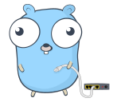

# gocrawl 
gocrawl is a gopher powered web crawler for the internets!

gocrawl will happily make it's way through a website and gather all of the data into a JSONL (line delimited JSON) file for you to do what you wish with.

It will capture a few things: 

* Every internal page it can find
* Every link on those pages, classified as internal/external/file/tel/mailto
* Errors getting those pages
 
It's pretty fast (check out the benchmarks) and capable  and is capable of crawling websites beyond 2.5M pages in size with a 16GB machine over a couple of hours.

gocrawl was created largely as a learning tool for the author, it's only their second attempt at a Go app so be kind!

If your interested in the journey, take a peek at the following:

* [Objective & Approach](./APPROACH.md)
* [A Tale of Web Crawler Optimization](./OPTIMIZATION.md)
* [Solution Discussion]() 

## Getting Started
Now before we run it - a note on politeness. It turned out that this tool is pretty fast, and very good at consuming all of your bandwidth. 

Please be respectful to site owner,  it's possible for you to encounter DDOS defences on sensitive sites. It's unlikely you'll hurt a site with a single instance of this tool from a domestic network link, but there is a remote possibility if the website is very fragile.  

By default the tool will open up 50 concurrent connections which should be plenty fast and shouldn't give most sites any trouble.

First of go get this tool:

```
$ go get https://github.com/jjmschofield/gocrawl
```

Then run it:

```
$ gocrawl -url=https://<your website>
``` 

## Options
Everyone likes options, here you go:
```
$ gocrawl -h
Usage of gocrawl:
  -dir string
        A file path to send results to (default "data")
  -url string
        an absolute url, including protocol and hostname (default "https://monzo.com")
  -workers int
        Number of crawl workers to run (default 50)

``` 

## Benchmarks
* **CPU:** i5-9600K (6 cores) @ ~4.3ghz
* **Mem:** 16GB DDR4 @ 2666ghz
* **Network:** ~80Mbps
* **Disk**: Samsung EVO SSD
* **OS**: Windows 10

## Contributing
## Tests
You can run the unit tests with coverage with:
```
$ go test ./internal/... -cover
ok      github.com/jjmschofield/gocrawl/internal/caches (cached)        coverage: 100.0% of statements
ok      github.com/jjmschofield/gocrawl/internal/counters       (cached)        coverage: 100.0% of statements
ok      github.com/jjmschofield/gocrawl/internal/crawl  (cached)        coverage: 96.8% of statements
ok      github.com/jjmschofield/gocrawl/internal/links  (cached)        coverage: 100.0% of statements
ok      github.com/jjmschofield/gocrawl/internal/md5    (cached)        coverage: 100.0% of statements
ok      github.com/jjmschofield/gocrawl/internal/pages  (cached)        coverage: 100.0% of statements
ok      github.com/jjmschofield/gocrawl/internal/scrape (cached)        coverage: 0.0% of statements [no tests to run]
ok      github.com/jjmschofield/gocrawl/internal/writers        (cached)        coverage: 0.0% of statements
```

There are some coverage gaps there - so feel free to help raise it if you wish :)

If you want to run the benchmark tests, do:
```
$ go test
 Ran 3 samples:
  runtime:
    Fastest Time: 19.587s
    Slowest Time: 20.167s
    Average Time: 19.930s ± 0.249s
  pages discovered:
    Smallest: 665.000
     Largest: 665.000
     Average: 665.000 ± 0.000
  pages crawled:
    Smallest: 665.000
     Largest: 665.000
     Average: 665.000 ± 0.000
  queue peak:
    Smallest: 56.000
     Largest: 66.000
     Average: 62.000 ± 4.320
  parallel scrape peak:
    Smallest: 100.000
     Largest: 100.000
     Average: 100.000 ± 0.000
------------------------------
```
This will execute 3 runs against the default website to benchmark the tool to give you a flavor for speed
                                                                               


## Thanks to
[Renee French](http://reneefrench.blogspot.com/) for the wonderful gopher icon from [this github repo](https://github.com/egonelbre/gophers).

